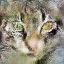

# DCGAN Implementation

This project implements a Deep Convolutional Generative Adversarial Network (DCGAN) for generating cat images using PyTorch.

## References
This implementation is inspired by the original paper ([arXiv:1511.06434](https://arxiv.org/abs/1511.06434))

## Example Results
Here are some examples generated by the DCGAN:

  
  
  
  
  

  
  
  
  
  

